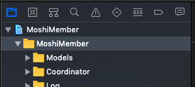
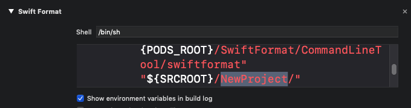

### New Project

#### 說明
        此專案是將自己常用的套件和程式放到這個專案中，之後如果需要新開專案的話，可以直接複製此專案然後在進行 Rename 
[Rename 教學](https://appmakers.dev/how-to-rename-xcode-project/)

注意：
1. 修改 Scheme Name 時，點擊 Scheme 然後點擊 Enter 鍵才能修改。
1. 需要重新 pod install
1. 需在 Build Settings 替換掉所有的 NewProject
1. 出現 The folder “Assets.xcassets” doesn’t exist.，是因為沒有改 project 中目錄的名稱。
    
1. 需要 delete 根目錄的 .git file, 在加入 Source Tree
1. 如果 Test Target 的 Run 失敗，則到 Test Target 修改開發團隊。
1. 在 Build Phases 中的 Swift Format 的 **NewProject** 換成你的目錄 

    
1. 多國語翻譯參考檔案 https://docs.google.com/spreadsheets/d/1d4M9ig7s_Za5wZnZ2CzssT-1oJjHUmkHTWd_4O-bcCc/edit#gid=271138619
        
#### New Project 做了什麼呢？
1. Add git, gitignore
1. pod init
    * pod 'R.swift'
    * pod 'SwiftLint'
    * pod 'DeviceGuru'
    * pod 'ReachabilitySwift'
    * pod 'SwiftFormat/CLI'
    * pod 'SnapKit', '~> 4.0'
    * pod 'HouJia', :git => 'https://github.com/JeromeTW/HouJia.git', :commit => '0086d20'

    **HouJia 中有許多我常用的套件包括 Log, Network, CoreData, ImageLoader, Cooedinator 以及許多工具程式，可以點擊上述連結進去看看**
    ```
    post_install do |installer|
        installer.pods_project.targets.each do |target|
            #puts "##### target: #{target} #####"
            target.build_configurations.each do |config|
                #puts "##### config: #{config} #####"
                if config.name == 'Test'
                config.build_settings['OTHER_SWIFT_FLAGS'] ||= ['-DDEBUG', '-DTEST']
                else
                config.build_settings['OTHER_SWIFT_FLAGS'] = '-DDEBUG'
                end
            end
        end
    end
    ```

1. Add swiftlint.yml
1. Add Build Phases **Before Compile Sources**
    
    * "$PODS_ROOT/R.swift/rswift" generate "$SRCROOT/R.generated.swift"

        **NOTE**

        Add **$TEMP_DIR/rswift-lastrun** to the "Input Files" and **$SRCROOT/R.generated.swift** to the "Output Files" of the Build Phase
        
    * "${PODS_ROOT}/SwiftLint/swiftlint"   
1. TestTarget, FirstTest.swift。已經設定好 Test Target 的 Other Swift Flag, 在 Test Target 也可以 Run #if DEBUG 的程式。 
1. 使用 Storyboarded 要記得在 .storyboard 設定 Storyboard ID
1. swiftformat
    * 改用 SwiftFormat Build Phase， 每次 Build 的時候都會調整格式。
    
    * ~~cd iOS Project 下，到用 “swiftformat --inferoptions . --output .swiftformat” 產生一個 .swiftformat 配置檔案（個人喜歡把 indent set 2），再下 “swiftformat .” 指令調整格式。~~

##### TODO
1. Firebase Crashly
1. fastlane (optional)

